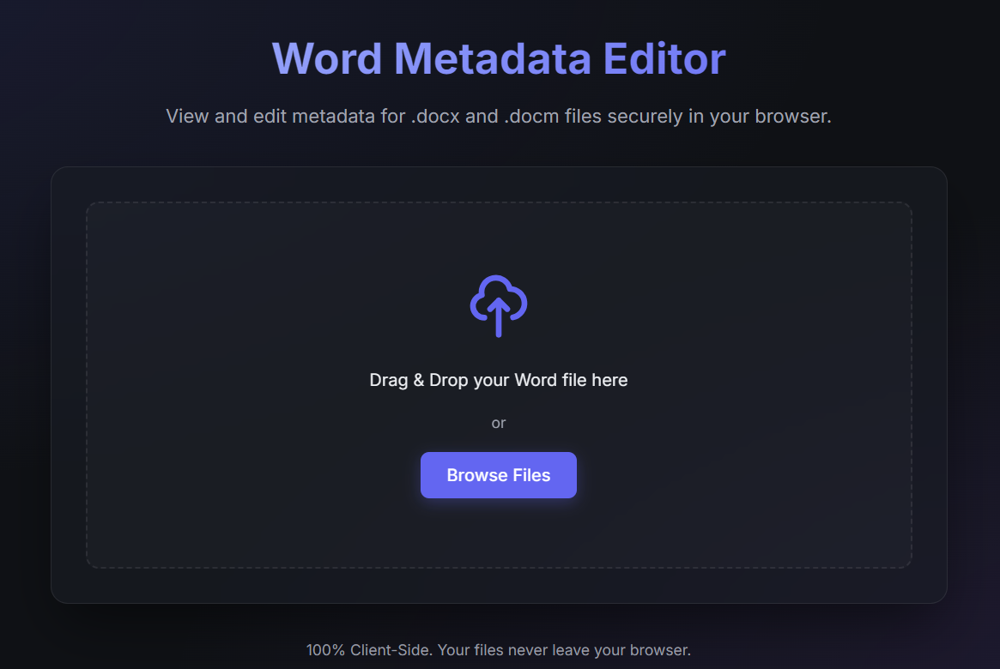

# Word Metadata Editor

A **100% Client-Side** web application for securely viewing and editing metadata of Office Open XML files (`.docx`, `.docm`) directly in your browser. 

Designed specifically to be static and hosted on platforms like GitHub Pages, meaning all processing happens offline right on your machine. **Your files never leave your browser.**

Link to GitHub Pages: [Link](https://ominoko.github.io/word-metadata-editor/)

## Features
- **Client-Side Operations:** Parses and modifies OOXML (zip) structures purely using Javascript.
- **Support for .docx and .docm:** Read standard Word formats securely.
- **Metadata Extraction:** Gathers Core Properties (Title, Subject, Creator, LastModifiedBy, etc.) and App Properties (Company, Application, Manager) transparently.
- **Dynamic Editor:** Edit the extracted strings seamlessly.
- **One-Click Safe Download:** Instantly repacks the modified files with `JSZip` and downloads identically to your system.

## Usage
1. Open up the web app in your browser (`index.html` or the Github Pages link).
2. Drag and drop any `.docx` or `.docm` file into the main area.
3. Review your metadata. Click **Edit** to modify.
4. Input your updated metadata and click **Save**. 
5. Your repacked file will automatically download as `edited_[your file name].docx`.

## Built With
- **Vanilla HTML5, CSS3, JavaScript**
- **JSZip 3.10.1** (For OOXML extraction and compression handling)
- **FileSaver.js 2.0.5** (For direct browser-download handling)

## Future Considerations
Because of strict client-side limitations, older compound binary files (like `.doc` files) are unsupported. Their complex binary structure (OLE2 CFB) is dangerous to edit blindly without heavyweight backend libraries (like Python's `olefile` or Java's `Apache POI`).

## License
MIT License. Free to use, fork, and distribute.

